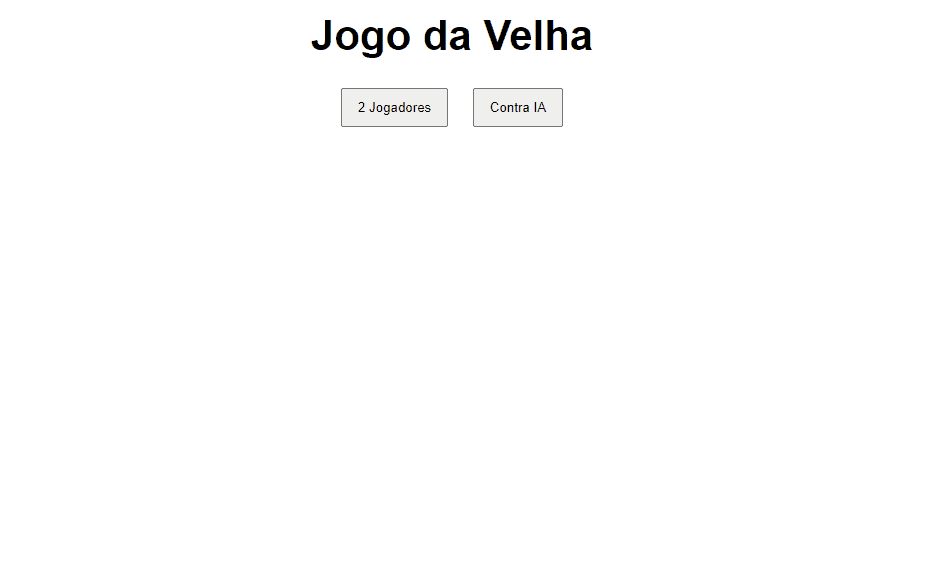

# Projeto Jogo da velha com Vanilla JS

## Descrição do projeto:
Projeto Jogo da Velha criado em Javascript. No jogo é possível jogar em 2 players, mas também é possível jogar
contra a máquina.

## Status do projeto:
✅ Finalizado.

## Features:
- [x] Estilização do projeto.
- [X] Opção de 2 jogadores.
- [x] Opção de jogar contra inteligência artificial.

## Exemplo de funcionamento:
### Gameplay com dois jogadores:

### Gameplay contra a máquina:

## Tecnologias utilizadas:
* HTML
* CSS
* Javascript

## Autor: 
[Vanderson Alves](https://github.com/vanderson-alves) | [Linkedin](https://www.linkedin.com/in/vanderson-alves07/)

